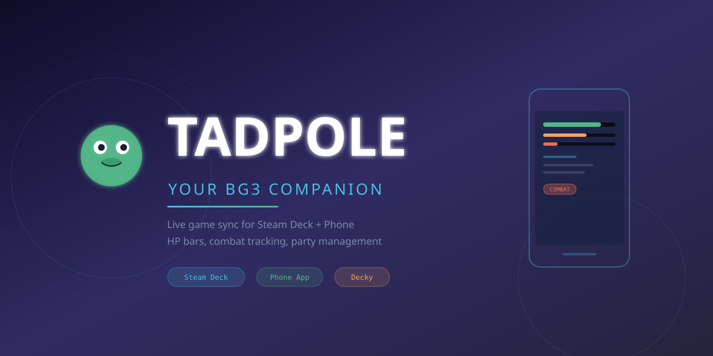

<p align="center">
  
</p>

<p align="center">
  <strong>Live Baldur's Gate 3 companion for Steam Deck + Phone</strong><br>
  Real-time HP bars, combat tracking, party management, and more.
</p>

<p align="center">
  <a href="https://tadpole-omega.vercel.app"><strong>Web App</strong></a>
  &nbsp;&bull;&nbsp;
  <a href="https://github.com/ZedaKeys/Tadpole/releases"><strong>Decky Plugin</strong></a>
  &nbsp;&bull;&nbsp;
  <a href="#how-it-works"><strong>How It Works</strong></a>
  &nbsp;&bull;&nbsp;
  <a href="#install"><strong>Install</strong></a>
</p>

---

## What is Tadpole?

Tadpole is a companion app for Baldur's Gate 3 that shows live game data on your phone while you play on Steam Deck. It reads your game state in real-time and displays HP bars, combat status, party info, gold, and more.

### Features

- **Live HP Bars** -- See every party member's HP on your phone, updating in real-time
- **Combat Tracker** -- Get notified when combat starts/ends, when someone goes down
- **Party Management** -- See your full party composition at a glance
- **Level Up Alerts** -- Toast notifications when you level up
- **Area Tracking** -- Know which zone you're in
- **Gold Counter** -- Track your gold without opening the inventory
- **WebSocket Bridge** -- Low-latency connection between Steam Deck and phone
- **DeckyLoader Plugin** -- Native integration into the Steam Deck UI

---

## How It Works

```
[BG3 Game] --(Lua Mod)--> [State File] --(Bridge Server)--> [Phone Browser]
                                |
                          [Steam Deck]
                          [Decky Plugin]
```

1. A **BG3 ScriptExtender Lua mod** writes your game state to a file
2. A **Node.js bridge server** on the Steam Deck reads that file and serves it via WebSocket
3. The **DeckyLoader plugin** manages the bridge server and shows status in the Steam Deck UI
4. Your **phone browser** connects to the bridge server and displays live data

---

## Install

### Prerequisites

Before installing the plugin, you need one thing:

- **DeckyLoader** -- The Steam Deck plugin loader. Install it from [deckbrew.xyz](https://decky.xyz)

That's it. Everything else (BG3 Script Extender, Node.js, bridge server, Lua mod) is installed automatically.

### Step 1: Install the Plugin

1. Open the Decky menu on your Steam Deck (frog icon in Quick Settings)
2. Go to the gear icon (Plugin Installer)
3. Switch to the **gear tab** at the bottom
4. Select **"Install Plugin From Zip"**
5. Download the latest zip from [Releases](https://github.com/ZedaKeys/Tadpole/releases)
6. Transfer it to your Deck (USB, SD card, or download directly)
7. Select the zip file and confirm

### Step 2: Run Setup

1. Open the Decky menu and find **Tadpole BG3 Companion**
2. Tap **"One-Click Setup"**
3. The plugin will install:
   - **BG3 Script Extender** -- Downloads DWrite.dll and configures Steam launch options
   - **Node.js** -- Downloads and installs locally (no sudo needed)
   - **Bridge Server** -- Copied from bundled files (works offline)
   - **BG3 Lua Mod** -- Copied from bundled files (needs BG3 launched once after Script Extender)
4. If the Lua mod couldn't install, the plugin will show instructions:
   - Close BG3 completely
   - Launch BG3 again -- Script Extender will create its folders on first run
   - Come back to Tadpole and hit Install Everything again
5. Done! The bridge starts automatically when BG3 launches

### Step 3: Connect Your Phone

1. Open **https://tadpole-omega.vercel.app** on your phone
2. Enter the IP address shown in the Tadpole plugin on your Deck
3. You're connected!

---

## Manual Install (Troubleshooting)

If the one-click setup fails, switch to Desktop Mode, open Konsole, and run:

### Install Node.js (no sudo)
```bash
mkdir -p ~/tadpole/node && cd /tmp && curl -sL https://nodejs.org/dist/v18.20.4/node-v18.20.4-linux-x64.tar.xz -o node.tar.xz && tar xf node.tar.xz -C ~/tadpole/node --strip-components=1 && rm node.tar.xz && ~/tadpole/node/bin/node --version
```

### Verify Bridge Server
```bash
ls ~/tadpole/bridge/server.js && echo "OK" || echo "Missing"
```

### View Plugin Log
```bash
cat /tmp/tadpole-plugin.log
```

### Test Bridge Connection
```bash
curl -s http://127.0.0.1:3456/status
```

---

## BG3 ScriptExtender

The Lua mod needs the BG3 ScriptExtender to work. Tadpole's one-click setup installs it automatically, but if you need to do it manually:

1. Download from [Norbyte's GitHub](https://github.com/Norbyte/bg3se/releases/latest)
2. Extract `DWrite.dll` to your `Baldurs Gate 3/bin/` directory
3. Set this Steam launch option for BG3: `WINEDLLOVERRIDES="DWrite.dll=n,b" %command%`
4. Launch BG3 once -- Script Extender will auto-update and create its folders
5. Then run Tadpole's setup to install the Lua mod

---

## Plugin Settings

| Setting | Default | Description |
|---------|---------|-------------|
| Auto-start with BG3 | On | Starts the bridge server when BG3 launches |
| Bridge Port | 3456 | Port for the WebSocket bridge server |
| Bridge Directory | ~/tadpole/bridge | Where the bridge server files live |

### UI Sections

- **Connection** -- Bridge server status, start/stop controls
- **Game** -- BG3 detection status
- **Live** -- Real-time HP bars, combat status, party data (when connected)
- **Phone App** -- IP address and URL to connect your phone
- **Settings** -- Port config, update checker, diagnostics, log viewer

### Advanced Features

- **Diagnostics Panel** -- Shows every path the plugin checks, what exists, what's missing
- **Terminal Commands** -- Copyable commands to run in Desktop Mode if auto-install fails
- **Log Viewer** -- View the plugin log directly in the UI
- **Update Checker** -- Checks GitHub for new plugin versions

---

## Architecture

```
tadpole/
├── app/                    # Next.js web app (phone companion)
│   ├── page.tsx            # Home page with connection panel
│   └── ...
├── bridge/                 # Node.js WebSocket bridge server
│   ├── server.js           # Express + WebSocket server
│   └── package.json
├── mod/                    # BG3 ScriptExtender Lua mod
│   └── TadpoleCompanion.lua
├── decky-plugin/           # DeckyLoader plugin (Steam Deck)
│   ├── main.py             # Python backend
│   ├── src/index.tsx       # React frontend
│   ├── bridge/             # Bundled bridge files
│   ├── mod/                # Bundled Lua mod
│   ├── plugin.json         # Plugin manifest
│   └── dist/               # Built frontend bundle
└── tadpole-plan/           # Planning documents
```

---

## Tech Stack

- **Web App** -- Next.js 16, React 19, TypeScript, Tailwind v4
- **Bridge Server** -- Node.js, Express, WebSocket (ws)
- **Decky Plugin** -- Python 3 (backend), React/TypeScript (frontend)
- **BG3 Mod** -- Lua (ScriptExtender)
- **Deployment** -- Vercel (web app), GitHub Releases (plugin)

---

## Credits

- [DeckyLoader](https://github.com/SteamDeckHomebrew/decky-loader) -- Steam Deck plugin framework
- [BG3 ScriptExtender](https://github.com/Norbyte/bg3se) -- BG3 modding framework
- Built with love for the BG3 community

## License

MIT
